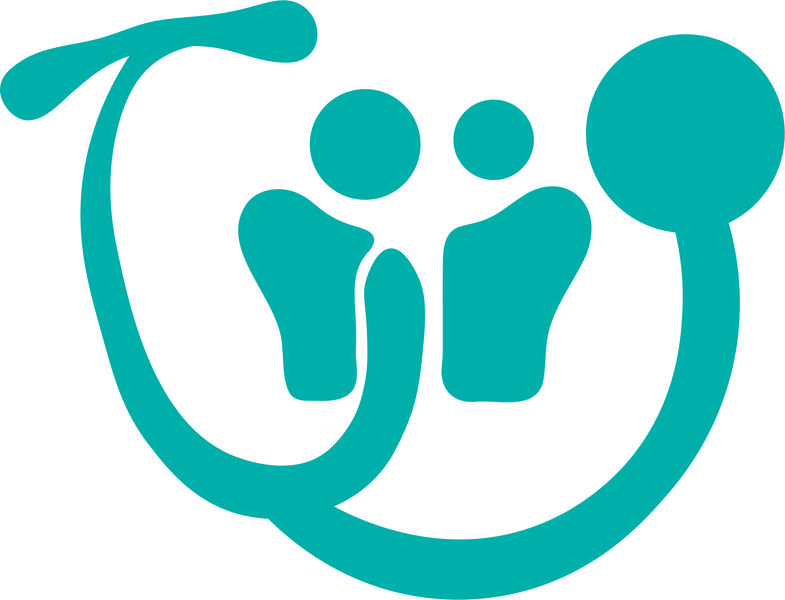
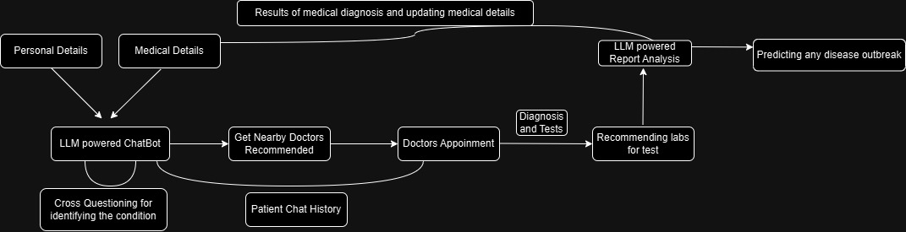

# CuraNet 🌐
**_Your Health. Your Community. Your CuraNet._**



---

Welcome to **CuraNet**! The one-stop healthcare app built for YOU. Whether you’re looking to check up on symptoms, find nearby doctors, or connect with people with similar health conditions, CuraNet has got your back! 🩺💙

## 🎯 Project Overview

**CuraNet** is a healthcare platform designed to provide **AI-driven medical assistance** and **community support**. From initial symptom checks to finding the best local healthcare options, we aim to make healthcare more accessible, secure, and community-centered. 🌍

### 🌟 What CuraNet Offers:
- **Symptom Analysis**: Get a quick check-up and insights powered by AI.
- **Doctor Finder**: Find the best healthcare providers near you.
- **Report Analysis**: Upload your lab reports for AI-powered insights.
- **Community Support**: Connect anonymously with others who understand.
- **Disease Outbreak Alerts**: Get real-time alerts for outbreaks in your area.
- **Lab Recommendations**: Find labs for recommended tests based on AI insights.

---

## 🛠️ Technologies Used

CuraNet uses the latest tech to bring you a seamless experience:

- **Frontend**: React, Tailwind CSS, MaterialUI
- **Backend**: Python (Flask/FastAPI), MongoDB
- **AI Models**: Pre-trained and fine-tuned models for accurate symptom analysis
- **APIs**: Google Maps API, OpenAI API, Perplexity API, WHO API
- **Security**: Bcrypt for encryption

---

## 🌐 How It All Works!

Check out the flow of the CuraNet ecosystem below!



1. **User Info**: Starts with basic personal and medical details.
2. **LLM-Powered ChatBot** 🤖: Helps with initial symptom analysis, asking cross-questions to better understand symptoms.
3. **Doctor Recommendations**: AI suggests nearby doctors based on your needs.
4. **Appointments & Tests**: Schedule appointments and keep track of diagnoses.
5. **Report Analysis**: Upload your test results for insights, powered by an LLM.
6. **Lab Suggestions**: Get lab recommendations for further tests.
7. **Disease Prediction**: Stay safe with alerts on any disease outbreak based on report trends.

---

## 🔒 Privacy and Security

We know your data is sensitive. CuraNet follows strict data security standards to protect your information. Using MongoDB for data storage ensures flexibility and compliance with privacy regulations. 🛡️

---

## 🚀 Getting Started

Want to get CuraNet up and running on your own system? Follow these steps:

1. **Clone the Repo**:
   ```bash
   git clone https://github.com/yourusername/CuraNet.git
   ```
2. **Install Dependencies**:
   ```bash
   pip install -r requirements.txt
   ```
3. **Run the App**:
   ```bash
   python app.py
   ```

*Note: You’ll need API keys for Google Maps, OpenAI, and Perplexity for full functionality.*

---

## 👥 Join the Community

Our community is the heart of CuraNet! Connect with others, share your experiences, and get the support you need. 💬

---

## 💬 Contribute

We’re always looking for collaborators to make CuraNet better! Check out our issues or create your own. Together, we can revolutionize healthcare accessibility!

---

## 📜 License

This project is licensed under the MIT License - see the LICENSE file for details.

---

### Created with ❤️ by the CuraNet Team

--- 
